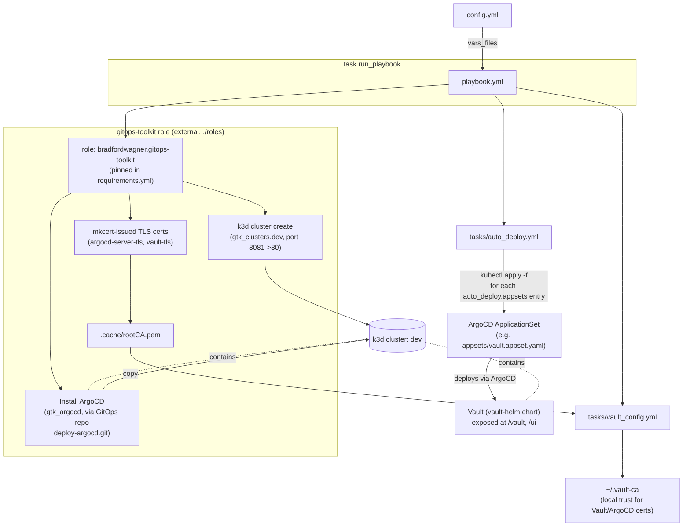

# Architecture

This repo is a thin Ansible wrapper around the external `bradfordwagner.gitops-toolkit` role. It
supplies configuration and a couple of post-provisioning steps to bootstrap a local k3d cluster with
ArgoCD, then (optionally) hands off application deployment to ArgoCD `ApplicationSet`s.

## Flow

## Components

| Component | Source | Role |
|---|---|---|
| `playbook.yml` | this repo | Orchestrates the three stages below against `hosts: localhost`. |
| `config.yml` | this repo | Single source of truth for cluster topology, ArgoCD install source, and which appsets to auto-deploy. |
| `bradfordwagner.gitops-toolkit` role | external, pinned via `requirements.yml`, installed into `./roles` | Creates the k3d cluster(s), issues local TLS certs, installs ArgoCD from a GitOps repo. |
| `tasks/auto_deploy.yml` | this repo | `kubectl apply`s any ArgoCD `ApplicationSet` manifests listed in `config.yml:auto_deploy.appsets`. |
| `appsets/vault.appset.yaml` | this repo | Example `ApplicationSet` — deploys HashiCorp Vault via ArgoCD once opted into `auto_deploy.appsets`. |
| `tasks/vault_config.yml` | this repo | Copies the cluster's root CA (`.cache/rootCA.pem`) to `~/.vault-ca` so local tools trust Vault/ArgoCD TLS. |

## Notes

- Everything under `Role` runs inside the external role's own tasks — its internals aren't in this
  repo; consult `./roles/bradfordwagner.gitops-toolkit` after running `ansible-galaxy install -r
  requirements.yml` if you need to trace behavior further.
- `auto_deploy.appsets` is empty by default in `config.yml`; the Vault appset is opt-in.
